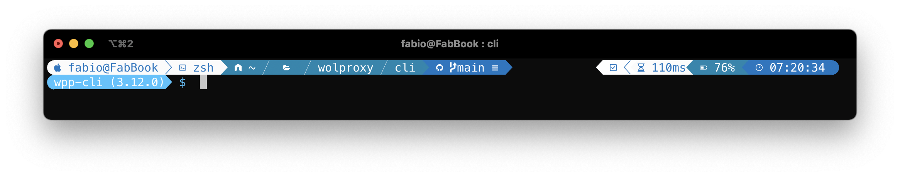
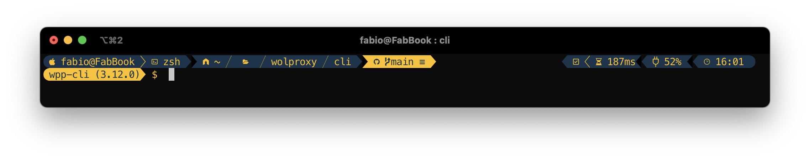
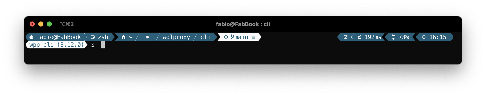

# Oh My Posh themes

A collection of personal themes to be used with Oh My ZSH / Oh My Posh

## Prerequisites

###  Install Oh My ZSH!

```bash
sh -c "$(curl -fsSL https://raw.githubusercontent.com/ohmyzsh/ohmyzsh/master/tools/install.sh)"
```

###  Install Oh My Posh

```bash
brew install jandedobbeleer/oh-my-posh/oh-my-posh
```

### Install fonts

```bash
brew tap homebrew/cask-fonts  # you only need this once
brew search nerd-font         # Search for font packages
brew install --cask font-meslo-lg-nerd-font 
```

### Install iTerm2

```bash
brew install --cask iterm2
```

## Themes

### Chosen One - [Blues](themes/chosenone-blues.omp.json)



### Chosen One - [Collab](themes/chosenone-collab.json)



## Chosen One - [Easter](themes/chosenone-easter.omp.json)


## Chosen One - [Jicor](themes/chosenone-jicor.omp.json)



