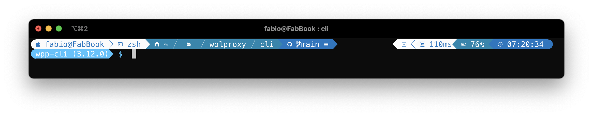

# Oh My Posh themes

A collection of personal themes to be used with Oh My ZSH / Oh My Posh

## Prerequisites

###  Install Oh My ZSH!

###  Install Oh My Posh

### Install fonts

### Install iTerm2

## Themes

### Chosen One - [Blueish](themes/chosenone-blueish.omp.json)

### Chosen One - [Collab](themes/chosenone-collab.json)

## Chosen One - [Easter](themes/chosenone-easter.omp.json)

## Chosen One - [Jicor](themes/chosenone-jicor.omp.json)

